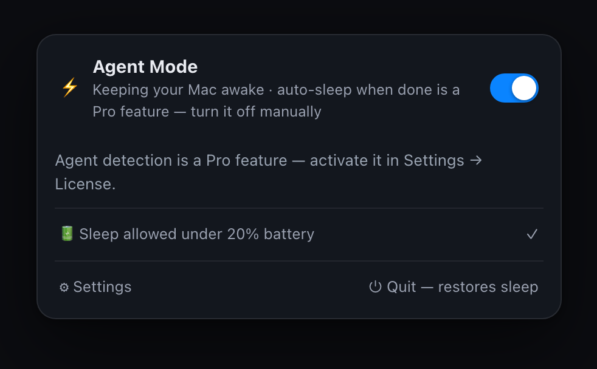
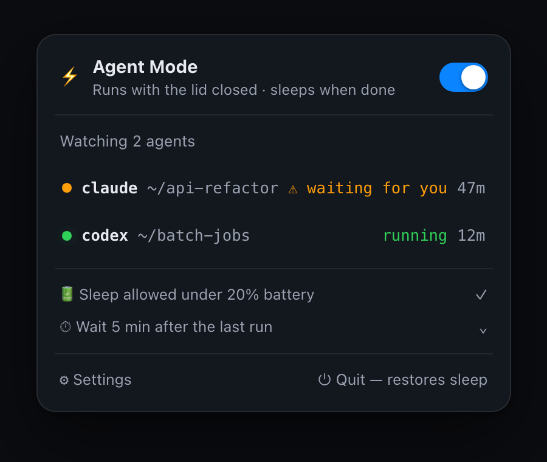

# Nemuri — open core

[English](README.md) · [简体中文](README.zh-CN.md) · [繁體中文](README.zh-TW.md) · [日本語](README.ja.md) · **한국어**

### Free — 수동 keep-awake 스위치



켜면 덮개를 닫아도 Mac이 깨어 있습니다. 감지도 자동화도 없습니다 — 직접 꺼야 합니다.
무료 앱이 하는 일은 여기까지입니다.

### Pro — 감지 자동화



Pro는 agent를 감시합니다. 실제로 일하는 동안에만 Mac을 깨워 두고, 확인을 기다리면 알려주고,
끝나면 Mac을 다시 슬립으로 돌려놓습니다. **이 패널 뒤의 감지 엔진은 클로즈드 소스이며
이 저장소에 없습니다.**
**[Nemuri](https://nemuri.app/ko/)에서 root로 실행되는 부분, 당신의 설정을 건드리는 부분, 외부로 통신할 수 있는 부분 — 직접 확인해 볼 수 있도록 공개합니다.**

Nemuri는 AI 에이전트(Claude Code, Codex)가 일하는 동안 Mac을 깨워 두고 — 덮개를 닫아도 — 일이 끝나면 다시 잠들게 하는 macOS 메뉴 막대 도구입니다.

그러려면 Nemuri는 **루트 헬퍼** 승인을 부탁드려야 합니다. 큰 부탁입니다. 이 저장소는 그 말을 그냥 믿지 않아도 되도록 존재합니다.

---

## 🔍 여기 있는 것(그리고 없는 것)

**이 저장소는 앱 전체가 아닙니다.** 신뢰에 직결되는 부분만 모은 부분집합입니다.

| 이 저장소에 있는 것 | 왜 여기 있는가 |
|---|---|
| `Sources/Helper` | **루트 LaunchDaemon**. root로 실행되는 유일한 구성 요소입니다. |
| `Sources/Shared` | 앱과 헬퍼 사이의 XPC 계약 — 헬퍼의 공격 표면 전부입니다. |
| `Sources/Core` | `pmset`/센티널/배터리 프리미티브(절대 걸리지 않는다는 보장), 에이전트 설정을 고쳐 쓰는 인스톨러, 그리고 로컬 IPC 프로토콜. |
| `Sources/HookBridge` | `aw-hook` / `aw-codex` — 당신의 `~/.claude/settings.json`과 `~/.codex/config.toml`에 기록되는 아주 작은 바이너리입니다. |

**이 저장소에 없는 것:** 감지 엔진(프로세스/세션/rollout 휴리스틱), 상태 머신, 오프라인 라이선스 서명 검증, 그리고 SwiftUI 앱. 이들은 모두 비공개 소스입니다 — Nemuri Pro가 파는 것이 바로 그 부분입니다.

그러니 이 공개가 당신에게 무엇을 주는지는 정확히 말하겠습니다. 당신이 감사할 수 있는 것은 **root로 무엇이 실행되는지**, **설정에 무엇이 기록되는지**, 그리고 **인터넷으로 소켓을 여는 코드가 있는지**입니다. 이 저장소만으로 Nemuri 앱 전체를 빌드할 수는 없고, 서명된 DMG 안의 바이너리도 이 소스 트리만으로 만들어진 것이 아닙니다.

이것은 실제 한계입니다. 흐리게 두느니, 분명히 말하는 쪽을 택합니다.

---

## ✅ 여기서 검증할 수 있는 것

- **최소한의 root 공격 표면.** 헬퍼가 노출하는 XPC 메서드는 정확히 세 개 — `setSleepDisabled(Bool)`, `currentState()`, `ping()` — 이고, 그다음엔 `/usr/bin/pmset`을 실행할 뿐입니다. 그 이상은 없습니다. 임의 명령 실행 없음, 센티널 밖으로의 파일 쓰기 없음, 네트워크 없음.
- **슬립 차단 상태로 절대 걸리지 않음.** 앱이 크래시하든, kill되든, 제거되든 `pmset disablesleep`은 반드시 `0`으로 돌아가야 합니다. 워치독, 60초 센티널 자체 점검, 부팅 시 복구 — 전부 `Sources/Helper/main.swift`에 있습니다.
- **네트워크 제로.** 이 트리에서 `URLSession`, `Network`, `socket(`, `connect(`를 grep해 보세요. 소켓은 `AF_UNIX`(로컬 IPC)뿐입니다. 헬퍼는 인터넷과 대화하지 않고, 라이선스 활성화도 마찬가지입니다 — Nemuri Pro의 잠금을 푸는 것은 오프라인 Ed25519 서명 파일이고, 검증은 로컬에서 이뤄집니다. 비행기 모드에서도 동작합니다.
- **당신의 설정은 백업되고 되돌릴 수 있음.** `~/.claude/settings.json`과 `~/.codex/config.toml`을 고쳐 쓰는 코드가 바로 `Sources/Core/Installer.swift`입니다. 쓰기 전에 백업하고, 완전히 복원할 수 있습니다.

## 🛠 직접 빌드하고, 직접 감사하기

```bash
swift build            # 헬퍼, hook 브리지, core를 빌드합니다
```

macOS 13+와 Swift 5.9+가 필요합니다. 이 트리는 단독으로 빌드됩니다 — 비공개 소스 의존성도, 빌드 시 네트워크 접근도 없습니다.

root 구성 요소부터 읽고 싶다면 `Sources/Helper/main.swift`(일부러 짧게 썼습니다)와 `Sources/Shared/AwakeShared.swift`(누가 헬퍼에 명령할 자격이 있는지를 정하는 XPC requirement 문자열)에서 시작하세요.

## 📦 Nemuri 받기

릴리스(서명·공증된 DMG)는 이 저장소의 [Releases](https://github.com/syfssb/nemuri/releases) 페이지에 올라가며, v1.0이 나온 뒤에는 Homebrew로도 설치할 수 있습니다. 수동 keep-awake 스위치는 무료로 쓸 수 있고, 감지 자동화는 1회 결제 유료 업그레이드입니다. 자세한 내용은 <https://nemuri.app/ko/>를 참고하세요.

## 🤝 기여하기

이 저장소의 코드에 대한 이슈와 PR을 환영합니다 — 특히 루트 헬퍼, 복구 경로, 설정 인스톨러를 건드리는 것이라면 더욱 그렇습니다. 헬퍼가 해서는 안 되는 일을 하게 만드는 방법을 찾았다면 꼭 알려 주세요. 공개 이슈 대신 이 저장소에 GitHub security advisory를 열어 주시기 바랍니다.

기여는 Apache License 2.0으로 받습니다(`LICENSE` 참고).

## 📄 라이선스

Apache License 2.0 — [`LICENSE`](LICENSE)와 [`NOTICE`](NOTICE)를 보세요.

Nemuri의 비공개 소스 부분(감지 엔진, 앱, 라이선스)은 이 라이선스의 적용을 받지 않으며, 여기서 배포하지 않습니다.

---

자세한 설명은 <https://nemuri.app/ko/>에서 볼 수 있습니다.
